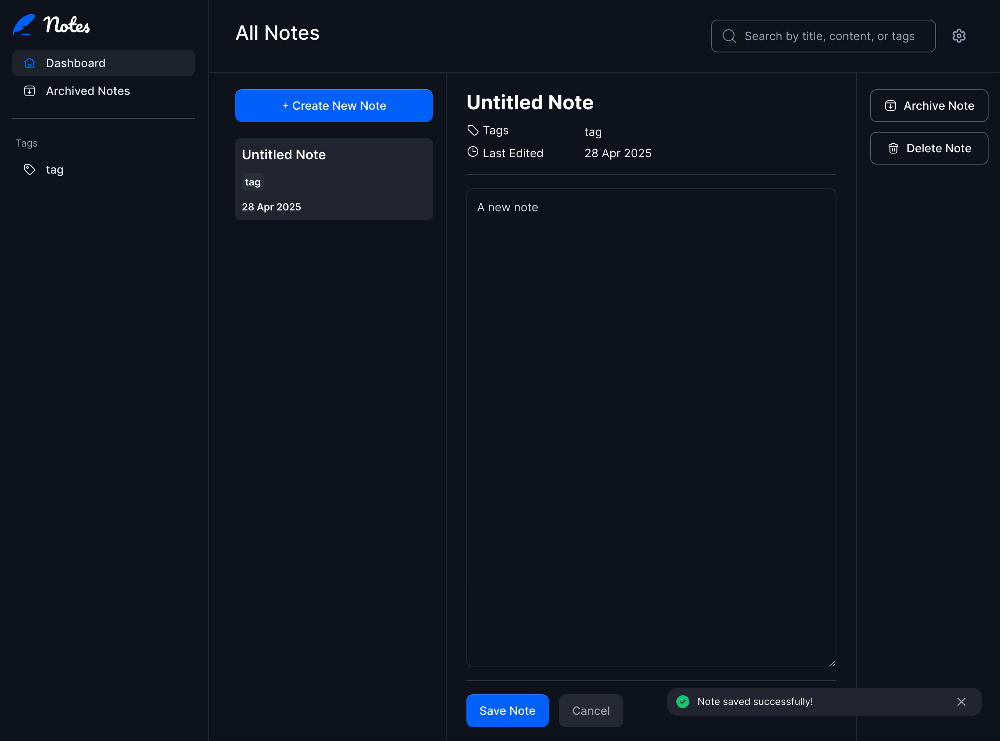

# Frontend Mentor - Note-taking web app solution

This is a solution to the [Note-taking web app challenge on Frontend Mentor](https://www.frontendmentor.io/challenges/note-taking-web-app-773r7bUfOG). Frontend Mentor challenges help you improve your coding skills by building realistic projects.

## Table of contents

- [Overview](#overview)
  - [The challenge](#the-challenge)
  - [Screenshot](#screenshot)
  - [Links](#links)
- [My process](#my-process)
  - [Built with](#built-with)
  - [What I learned](#what-i-learned)
  - [Continued development](#continued-development)
  - [Useful resources](#useful-resources)
- [Author](#author)

## Overview

### The challenge

Users should be able to:

- Create, read, update, and delete notes
- Archive notes
- View all their notes
- View all archived notes
- View notes with specific tags
- Search notes by title, tag, and content
- Select their color theme
- Select their font theme
- Receive validation messages if required form fields aren't completed
- Navigate the whole app and perform all actions using only their keyboard
- View the optimal layout for the interface depending on their device's screen size
- See hover and focus states for all interactive elements on the page
- **Bonus**: Save details to a database (build the project as a full-stack app)
- **Bonus**: Create an account, log in, change password (add user authentication to the full-stack app)
- **Bonus**: Reset their password (add password reset to the full-stack app)

### Screenshot



### Links

- Solution URL: [Add solution URL here](https://your-solution-url.com)
- Live Site URL: [notes.robertirwin.online](https://notes.robertirwin.online/)

## My process

I have been a JavaScript developer for a long time. Laravel is a big departure from popular JS frameworks, but it is a very nice developer experience, and by offering cohesive starter packs, the idea is that I would not have to scrounge the internet for JavaScript packages that work together. The Laravel ecosystem has simplified so much of the configuration and deployment, it's hard to imagine going back to JavaScript voluntarily.

### Built with

- HTML/CSS/JS
- Desktop-first
- Mobile view
- Laravel Livewire Starter Kit:
    - [Laravel 12](https://laravel.com/)
    - [Tailwind 4](https://tailwindcss.com/)
    - [Livewire 3](https://livewire.laravel.com/)
    - [AlpineJS ](https://alpinejs.dev/)
    - [Flux UI](https://fluxui.dev/)
- Amazon SES

### What I learned

I underestimated how long it takes to become productive with a new set of tools. Though I could never dedicate as much time as I would have liked in a given day, it still took longer than I thought. I had to unlearn some of my old JavaScript writing habits, and instead make better use out of the libraries available.

I started out with the desktop view, but since Tailwind CSS is more geared towards mobile-first, maybe that would have been better.

I am overall happy with how Alpine and Livewire work together, though the interplay between them can be tricky at times. The solution in the end can be nicely readable. This is how I eventually bound the title of a note in the sidebar with the note form field:

```php
<?php
use Livewire\Volt\Component;

use Livewire\Attributes\On;
new class extends Component {

    public int $noteId = -1;
    public string $title = '';
    public string $class = '';

    #[On('title-updated.{noteId}')]
    public function titleUpdatedEditor($title)
    {
        $this->title = $title;
    }
}; ?>

<div class="{{ $this->class }}">{{ $this->title ?: "Untitled Note" }}</div>
```

### Continued development

This is my first full-stack hypermedia application. Hypermedia is kind of a new frontier in modern web development as an alternative to JavaScript thick-client single-page-applications, and I'm eagerly watching this space. I feel confident in tackling another full-stack project with Laravel.

### Useful resources

- [Hypermedia Systems](https://hypermedia.systems/) - Ultimately convinced me to look for alternatives to the typical JSON API + front-end framework architecture.

## Author
This solution was developed by Robert Irwin using open source tools.

- Website - [Robert Irwin](https://rowinf.github.io)
- Frontend Mentor - [@rowinf](https://www.frontendmentor.io/profile/rowinf)
- LinkedIn - [Rob](https://www.linkedin.com/in/robert-irwin-23019730/)
